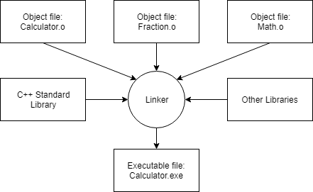

# CPP-Rev
Advanced C++ and C++11 new feature review/training. Reviewing C++ with the intention of penetrating into CG. Thus basic function will not be involved in this review.
## Part1. Intro
- Compile and link
   - Procedure   
     
   - Compile  
       
     - Compiler checks the code whether it follows the rules of the C++ language.  
     - Then translate the C++ source code into a machine language (.o)
   - Link  
       
     - Combine generated obj files into an executable one.
     - Add on a library file <- C++ STL
## Part2. Basics
1. Variables
   - l-value and r-value  
      **l-value** has a persistent addr while opposite for **r-value**   
      ``` C++
      int y;      // define y as an integer variable
      y = 4;      // r-value 4 evaluates to 4, which is then assigned to l-value y
      y = 2 + 5;  // r-value 2 + r-value 5 evaluates to r-value 7, which is then assigned to l-value y
      
      int x;      // define x as an integer variable
      x = y;      // l-value y evaluates to 7 (from before), which is then assigned to l-value x.
      x = x;      // l-value x evaluates to 7, which is then assigned to l-value x (useless!)
      x = x + 1;  // l-value x + r-value 1 evaluate to r-value 8, which is then assigned to l-value x.
      ```
2. Keywords and indentifier
   
   - `*` for C++98
   - `**` for C++11


## Reference
Learning within online course is not recommended(basically time-consuming). It's better to read reference material if you have a programming foundation. As for the material, here you go.
* [LearnCPP.com](https://www.learncpp.com/cpp-tutorial/introduction-to-cplusplus/)
   