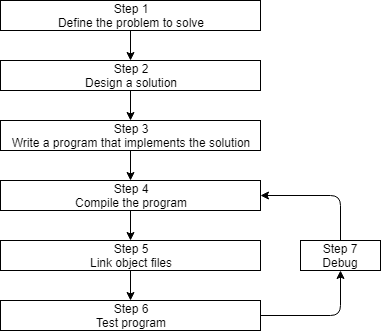
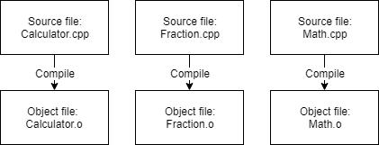

# Part1. Intro
## Compile and link
- Procedure   
  
- Compile  
    
  - Compiler checks the code whether it follows the rules of the C++ language.  
  - Then translate the C++ source code into a machine language (.o)
- Link  
    
  - Combine generated obj files into an executable one.
  - Add on a library file <- C++ STL