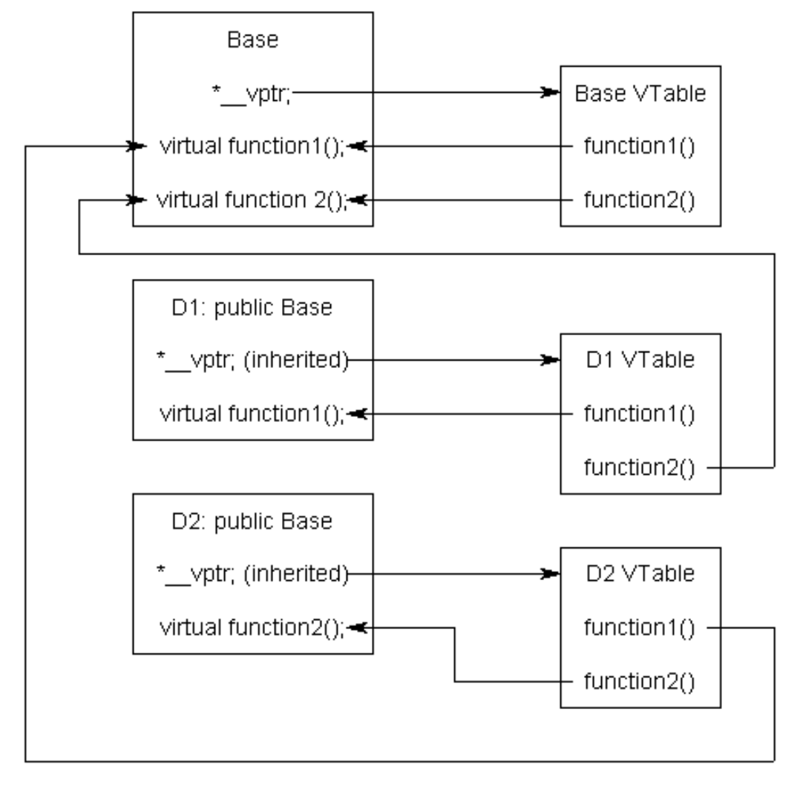

# Virtual Functions
## Pointers and references to the base class of derived objects
1. Pointers, references, and derived classes
2. Use for pointers and references to base classes
## Virtual functions and polymorphism
1. Virtual functions and polymorphism
    ```C++
    class Base
    {
    public:
        virtual const char* getName() { return "Base"; } // note addition of virtual keyword
    };
    
    class Derived: public Base
    {
    public:
        virtual const char* getName() { return "Derived"; }
    };
    
    int main()
    {
        Derived derived;
        Base &rBase = derived;
        std::cout << "rBase is a " << rBase.getName() << '\n';
    
        return 0;
    }
    ```
2. Use of the virtual keyword  
   - If a function is marked as virtual, all matching overrides are also considered virtual, even if they are not explicitly marked as such. However, having the keyword virtual on the derived functions does not hurt, and it serves as a useful reminder that the function is a virtual function rather than a normal one.
3. Return types of virtual functions
   - the return type of a virtual function and its override must match
4. Do not call virtual functions from constructors or destructors
## The override and final specifiers, and covariant return types
1. two special identifiers to C++ for inheritance
   1. override
   2. final
2. The override specifier
   1. Override can be applied to any override function by placing the specifier in the same place const would go. If the function does not override a base class function, the compiler will flag the function as an error.
   2. Demo
        ```C++
        class A
        {
        public:
            virtual const char* getName1(int x) { return "A"; }
            virtual const char* getName2(int x) { return "A"; }
            virtual const char* getName3(int x) { return "A"; }
        };
        
        class B : public A
        {
        public:
            virtual const char* getName1(short int x) override { return "B"; } // compile error, function is not an override
            virtual const char* getName2(int x) const override { return "B"; } // compile error, function is not an override
            virtual const char* getName3(int x) override { return "B"; } // okay, function is an override of A::getName3(int)
        
        };
        ```
3. The final specifier
   1. There may be cases where you don’t want someone to be able to override a virtual function, or inherit from a class. The final specifier can be used to tell the compiler to enforce this.
   2. Demo
        ```C++
        class A
        {
        public:
            virtual const char* getName() { return "A"; }
        };
        
        class B : public A
        {
        public:
            // note use of final specifier on following line -- that makes this function no longer overridable
            virtual const char* getName() override final { return "B"; } // okay, overrides A::getName()
        };
        
        class C : public B
        {
        public:
            virtual const char* getName() override { return "C"; } // compile error: overrides B::getName(), which is final
        };
        ```
   3. also prevent inheriting from a class
        ```C++
        class B final : public A // note use of final specifier here
        ```
4. Covariant return types
   -  If the return type of a virtual function is a pointer or a reference to a class, override functions can return a pointer or a reference to a derived class.
   -  Demo
        ```C++
        class Base
        {
        public:
            virtual Base* getThis() { std::cout << "called Base::getThis()\n"; return this; }
            void printType() { std::cout << "returned a Base\n"; }
        };
        
        class Derived : public Base
        {
        public:
            virtual Derived* getThis() { std::cout << "called Derived::getThis()\n";  return this; }
            void printType() { std::cout << "returned a Derived\n"; }
        };
        ```
## Virtual destructors, virtual assignment, and overriding virtualization
1. You should **always** make your destructors virtual if you’re dealing with inheritance.
    ```C++
    #include <iostream>
    class Base
    {
    public:
        ~Base() // note: not virtual
        {
            std::cout << "Calling ~Base()" << std::endl;
        }
    };
    class Derived: public Base
    {
    private:
        int* m_array;
    public:
        Derived(int length)
        {
            m_array = new int[length];
        }
    
        ~Derived() // note: not virtual
        {
            std::cout << "Calling ~Derived()" << std::endl;
            delete[] m_array;
        }
    };
    int main()
    {
        Derived *derived = new Derived(5);
        Base *base = derived ;
        delete base; //not release the *m_array
    
        return 0;
    }
    ```
2. **Whenever you are dealing with inheritance, you should make any explicit destructors virtual.**
3. Virtual assignment
   1. not recommended
4. Ignoring virtualization
    ```C++
    Derived derived;
    Base &base = derived;
    // Calls Base::GetName() instead of the virtualized Derived::GetName()
    std::cout << base.Base::getName() << std::endl;
    ```
## Early binding and late binding
1. Binding 
   1. refers to the process that is used to convert identifiers (such as variable and function names) into addresses.
2. Early binding
   1. Early binding means the compiler is able to directly associate the identifier name with a machine address.
3. Late Binding
   1. In some programs, it is not possible to know which function will be called until runtime. This is known as late binding.
   2. Demo
        ```C++
        int add(int x, int y)
        {
            return x + y;
        }
        
        int main()
        {
            // Create a function pointer and make it point to the add function
            int (*pFcn)(int, int) = add;
            std::cout << pFcn(5, 3) << std::endl; // add 5 + 3
        
            return 0;
        }
        ```
## The virtual table
1. Definition
   1. The virtual table is a lookup table of functions used to resolve function calls in a dynamic/late binding manner.
2. Graphical
    
3. what happens when we try to call dPtr->function1()
    ```C++
    int main()
    {
        D1 d1;
        Base *dPtr = &d1;
        dPtr->function1();
    }
    ```
   1. the program recognizes that function1() is a virtual function
   2. the program uses dPtr->__vptr to get to D1’s virtual table
   3. it looks up which version of function1() to call in D1’s virtual table.
   4. This has been set to D1::function1().
## Pure virtual functions, abstract base classes, and interface classes
1. pure virtual function (or abstract function)
   1. assign the function the value 0
        ```C++
        class Base
        {
        public:
            const char* sayHi() { return "Hi"; } // a normal non-virtual function    
        
            virtual const char* getName() { return "Base"; } // a normal virtual function
        
            virtual int getValue() = 0; // a pure virtual function
        
            int doSomething() = 0; // Compile error: can not set non-virtual functions to 0
        };
        ```
    2. any class with one or more pure virtual functions becomes an abstract base class
2. Pure virtual functions with bodies
   1. pure virtual function can have a body not inline(even though it is still virtual), and can provide default behaviour for derived classes
   2. for instance
     ```C++
     virtual const char* speak()
     {
         return Animal::speak(); // use Animal's default implementation
     }
     ```
3. Interface classes
   1. An interface class is a class that has no member variables, and where all of the functions are pure virtual!
   2. sample - **virtual destructor**
        ```C++
        class IErrorLog
        {
        public:
            virtual bool openLog(const char *filename) = 0;
            virtual bool closeLog() = 0;
        
            virtual bool writeError(const char *errorMessage) = 0;
        
            virtual ~IErrorLog() {} // make a virtual destructor in case we delete an IErrorLog pointer, so the proper derived destructor is called
        };
        ```
## Virtual base classes
1. [The diamond problem](https://github.com/ceej7/CPP-Rev/blob/master/md/Chapter11Inheritance.md#multiple-inheritance)
2. Virtual base classes
   1. To share a base class, simply insert the `virtual` keyword in the inheritance list of the derived class.
   2. sample - note that the `base obj(PoweredDevice)` should be constructed in `copier`
        ```C++
        class PoweredDevice
        {
        public:
            PoweredDevice(int power)
            {
                std::cout << "PoweredDevice: " << power << '\n';
            }
        };
        
        class Scanner: virtual public PoweredDevice // note: PoweredDevice is now a virtual base class
        {
        public:
            Scanner(int scanner, int power)
                : PoweredDevice(power) // this line is required to create Scanner objects, but ignored in this case
            {
                std::cout << "Scanner: " << scanner << '\n';
            }
        };
        
        class Printer: virtual public PoweredDevice // note: PoweredDevice is now a virtual base class
        {
        public:
            Printer(int printer, int power)
                : PoweredDevice(power) // this line is required to create Printer objects, but ignored in this case
            {
                std::cout << "Printer: " << printer << '\n';
            }
        };
        
        class Copier: public Scanner, public Printer
        {
        public:
            Copier(int scanner, int printer, int power)
                : PoweredDevice(power), // PoweredDevice is constructed here
                Scanner(scanner, power), Printer(printer, power)
            {
            }
        };
        ```
## Object slicing
1. sample
    ```C++
    class Base
    {
    protected:
        int m_value;
    
    public:
        Base(int value)
            : m_value(value)
        {
        }
    
        virtual const char* getName() const { return "Base"; }
        int getValue() const { return m_value; }
    };
    
    class Derived: public Base
    {
    public:
        Derived(int value)
            : Base(value)
        {
        }
    
        virtual const char* getName() const { return "Derived"; }
    };
    ```
2. slicing and functions
    ```C++
    void printName(const Base base) // note: base passed by value, not reference
    {
        std::cout << "I am a " << base.getName() << '\n';
    }
    ```
3. Slicing vectors - contents in vector are copied
    ```C++
    std::vector<Base> v;
    v.push_back(Base(5)); // add a Base object to our vector
    v.push_back(Derived(6)); // add a Derived object to our vector

        // Print out all of the elements in our vector
    for (int count = 0; count < v.size(); ++count)
        std::cout << "I am a " << v[count].getName() << " with value " << v[count].getValue() << "\n";

    return 0;
    ```
    - solution - `std::reference_wrapper`
        ```C++
        std::vector<std::reference_wrapper<Base> > v; // our vector is a vector of std::reference_wrapper wrapped Base (not Base&)
        Base b(5);
        Derived d(6);
        v.push_back(b);
        v.push_back(d);
        for (int count = 0; count < v.size(); ++count)
            std::cout << "I am a " << v[count].get().getName() << " with value " << v[count].get().getValue() << "\n"; // we use .get() to get our element from the wrapper
        ```
4. The Frankenobject
    ```C++
    Derived d1(5);
    Derived d2(6);
    Base &b = d2;
    b = d1; // problematic
    ```
    1. call the `operator=` in the base part of d2
    2. then only copied part of the derived class
## Dynamic casting
1. The need for dynamic_cast
   - you’ll often encounter cases where you have a pointer to a base class, but you want to access some information that exists only in a derived class. - downcasting
2. dynamic_cast
    ```C++
    Derived *d = dynamic_cast<Derived*>(b); // use dynamic cast to convert Base pointer into Derived pointer
    std::cout << "The name of the Derived is: " << d->getName() << '\n';
    ```
3. dynamic_cast failure
    ```C++
    if (d) // make sure d is non-null
        std::cout << "The name of the Derived is: " << d->getName() << '\n';
    ```
   1. With protected or private inheritance.
   2. For classes that do not declare or inherit any virtual functions (and thus don’t have a virtual table).
   3. In certain cases involving virtual base classes
4. Downcasting with static_cast
   1. It turns out that downcasting can also be done with static_cast. The main difference is that static_cast does no runtime type checking to ensure that what you’re doing makes sense.
   2. not recommended
5. dynamic_cast and references with `exception thrown`
    ```C++
    Derived apple(1, "Apple");
    Base &b = apple;
    Derived &d = dynamic_cast<Derived&>(b); 
    ```
6. Downcasting vs virtual functions
   1. prefer virtual functions over downcasting
   2. except for the moment when virtual functions cannot be implemented
## Printing inherited classes using operator<<
1. The challenges with operator<<
    ```C++
    class Base
    {
    public:
        Base() {}
    
        virtual void print() const { std::cout << "Base";  }
    
        friend std::ostream& operator<<(std::ostream &out, const Base &b)
            {
                out << "Base";
                return out;
            }
    };
    
    class Derived : public Base
    {
    public:
        Derived() {}
    
        virtual void print() const override { std::cout << "Derived"; }
    
        friend std::ostream& operator<<(std::ostream &out, const Derived &d)
            {
                out << "Derived";
                return out;
            }
    
    };
    ```
2. Can we make Operator << virtual? - no!
3. The solution -delegate responsibilty to a "virtuable" function
    ```C++
        class Base
        {
        public:
            Base() {}
        
            // Here's our overloaded operator<<
            friend std::ostream& operator<<(std::ostream &out, const Base &b)
            {
                // Delegate printing responsibility for printing to member function print()
                return b.print(out);
            }
        
            // We'll rely on member function print() to do the actual printing
            // Because print is a normal member function, it can be virtualized
            virtual std::ostream& print(std::ostream& out) const
            {
                out << "Base";
                return out;
            }
        };
        
        class Derived : public Base
        {
        public:
            Derived() {}
        
            // Here's our override print function to handle the Derived case
            virtual std::ostream& print(std::ostream& out) const override
            {
                out << "Derived";
                return out;
            }
        };
        ```